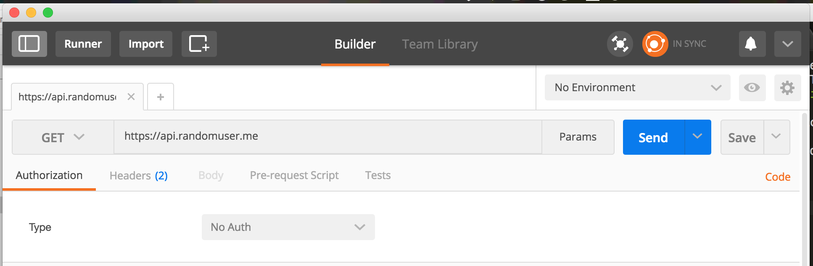
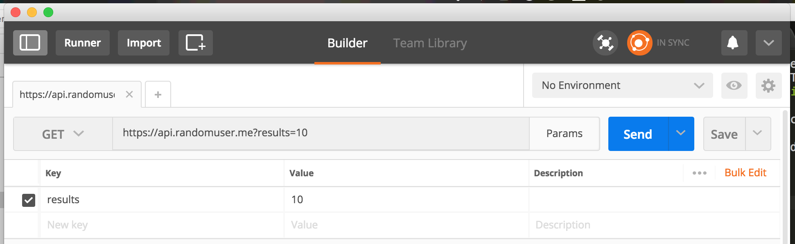
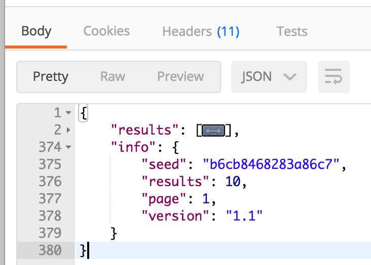

# AC3.2-APIs-II
### Detailing and Managing Requests

---
### Readings:

1. [HTTP Methods - tutorialspoint](https://www.tutorialspoint.com/http/http_methods.htm)
2. [What is the difference between POST and GET? - Stackoverflow](http://stackoverflow.com/questions/3477333/what-is-the-difference-between-post-and-get)
3. [Understanding HTTP Basics - OneMonth](http://learn.onemonth.com/understanding-http-basics)
4. [The Rubber Duck Story - Youtube](https://www.youtube.com/watch?v=huOPVqztPdc)
5. [Using Storyboards and Swift to Build Dynamic Tableviews](http://www.techotopia.com/index.php/Using_Storyboards_and_Swift_to_Build_Dynamic_TableViews_with_Prototype_Table_View_Cells)
6. [NSUserDefaults - Coding Explorer](http://www.codingexplorer.com/nsuserdefaults-a-swift-introduction/)
	- Note: Read this if you have time, but we may not get to it

### References:
1. [Random User API Doc](https://randomuser.me/documentation)
1. [HTTP Header Fields - tutorialspoint](https://www.tutorialspoint.com/http/http_header_fields.htm)
	- Note: this is to have for reference, there's much more info here than you need right now
2. [HTTP Status Codes - REST API Tutorial](http://www.restapitutorial.com/httpstatuscodes.html)
3. [HTTP Methods for RESTful Services - REST API Tutorial](http://www.restapitutorial.com/lessons/httpmethods.html)
4. [What is REST? - REST API Tutorial](http://www.restapitutorial.com/lessons/whatisrest.html)
5. [Rubber Duck Debugging - Wiki](https://en.wikipedia.org/wiki/Rubber_duck_debugging)

### Definitions:

1. **HTTP Parameters**: Parameters specify the variable parts of your resources: the data that you are working with. There are several types of parameters including HTTP Headers and Query Parameters. [SOAPUI](https://www.soapui.org/testing-dojo/best-practices/understanding-rest-headers-and-parameters.html)
1. **Query Paramters**: The query parameters are separated from the hierarchical parameters by the question mark. The exact syntax of the actual parameters is not generically defined, but normally are a sequence of key-value pairs (separated by an equal sign) [SOAPUI](https://www.soapui.org/testing-dojo/best-practices/understanding-rest-headers-and-parameters.html)

---
### Objectives

- Understanding query parameters and how they affect the data returned from an API.
- Building functions to send variable parameters

---
### 1. Request Parameters

By default, the Random User API returns a single user when making at `GET` request to its base URL, `https://randomuser.me/api/`. With our current implementation, we can use pull to refresh to get additional users. But what if we needed 5, 10, 50, or 100 users at a time? Pulling to refresh that many times each run of the app would be time consuming and impractical. 

Fortunately the Random User API, like nearly all other API's, allow you to specify additional *parameters* about the response you'd like to receive for your request. In our case, the Random User API has a *query parameter*, `results`, that determines how many users get returned at once. 

#### Query Parameters in Postman

We're going to start testing parameters using Postman since it's far easier to debug the actualy request. When we're confident the request is correct, we can write the code for it.
So in Postman, make sure that the base URL for API is entered into the address bar:



To the immediate right of the bar should be a button that reads "Params", click on that an you should see additional text fields appear below the address bar. These extra fields correspond to the request's (optional) query parameters. Query parameters are simply key/value pairs that are interpreted by the API in order to modify it's response. In this case, we're telling the API to send back 10 users rather than the default 1. Notice how the URL changes when you add these parameters:



You got some additional information appended to the end of the URL. Query parameters have a designated syntax of key/value pairs separated by `&` and immediately following a `?` in a URL. You'll also sometimes see parameters with keys that take multiple values, usually separated by a comma. 

Send the request and observe the returned `JSON`. You can verify your request's results by looking at the `JSON`'s `info` key:



#### Adding Query Parameters in Code

Let's replicate this in code. The simplest solution to this problem is to update the URL we're using to the updated one in Postman (you could copy/paste the URL):

```swift
// In APIManager.swift
private static let randomAPIEndpoint: URL = URL(string: "https://api.randomuser.me?results=10")!
```

Though, parameters describe a variation in the data we'd like to receive from an API. So defining a static URL to describe a variable result doesn't make sense. Think about it, what if we sometimes needed 20 results, or 50. We'd have to have separate, static, URL's instantiated for each. And maybe even multiple functions that are essentially making the same request, just receiving back differing amounts of Users. 

<details>
<summary>Q: What would be a better approach to handle variable numbers of users in responses from the API?</summary>
<br>
Adding a parameter for result size to <code>getRandomUserData(completion:)</code>
<br>
<br>
</details>
<br>

Let's update the `getRandomUserData` method in `APIManager` to: 

```swift
// include a parameter for number of results to return
func getRandomUserData(results: Int, completion: @escaping ((Data?)->Void)) {
	// the other code
}
```

Now were can adjust the base URL for the API to include the `results` query param. But how do we go about updating the URL? Breaking the problem down, we have a URL that looks like `https://api.randomuser.me` and we want to add another piece that looks like `?results=<some number>`. 

<details>
	<summary>Hint 1</summary>
	<br>
		There's a property on <code>URL</code> that gets the current URL as a string.
	<br><br>
</details>
<details>
	<summary>Hint 2</summary>
	<br>
		You can use string interpolation
	<br><br>
</details>
<details>
	<summary>Hint 3</summary>
	<br>
		Alternatively, you can use `URL(string:relativeTo:)`
	<br><br>
</details>
<br>

We can access the `String` representation of a `URL` through its `.absoluteString` property. Using that base `String`, we can use string interpolation to append the query information:

```swift
	func getRandomUserData(results: Int, completion: @escaping ((Data?)->Void)) {
		let queryString = APIManager.randomAPIEndpoint.absoluteString + "?results=\(results)"
		let queryURL = URL(string: queryString)!
	
		let session: URLSession = URLSession(configuration: URLSessionConfiguration.default)
		
		// make sure you update your dataTask to use the new URL 
		session.dataTask(with: queryURL) { (data: Data?, response: URLResponse?, error: Error?)
			// ...other code...
		}
	}
```

Update your function call in `UsersTableViewController` to now include the `results` parameter, and give it any value you'd like. Re-run your project and observe the difference. 


### 3. Exercises:

> *Remember to use Postman to test your requests first*

Referring to the [documentation for the RandomUser API](https://randomuser.me/documentation), you can see there are a number of query parameters you can include, for example:  

|`Key`|Purpose|Example|
|---|---|---|
|`results`| Determines the number of users that are returned | https://api.randomuser.me?results=10 |
|`gender`| Determines if male and/or female users should be returned | https://api.randomuser.me?gender=female |
|`nat`| Determines which nationalities should be returned | https://api.randomuser.me?nat=US,BR,GB |


1. Update `APIManager.getRandomUserData` to accept an additional parameter, `gender: String`. 
	- *Note*: The parameter accepts two values, `male` and `female`. But can be omitted entirely if you want to receive results that are both male and female. 
2. Update `APIManager.getRandomUserData` once more to have an additional parameter, `nationality: String`. 
	- *Note*: This parameter can accept a comma-separated list of values corresponding to the nationalities of the users the API should return. First start with a single value, but after verifying that it works, make sure you can pass in multiple values for the `nat` key.
3. Now, adjust the `gender` parameter to be of type `UserGender`, which you will define as an enum: 
	```swift
	enum UserGender{
		case male, female, both
	}
	```
	- Do this with nationality as well, using an enum named `UserNationality`. To keep things simple, limit your cases to `us`, `tr` and `nl`. *(I chose these 3 specifically because the results will be very distinct and easily identifiable)*
4. **Advanced**: Give your enums an associated type of `String`. (*notice how much code you save in doing this small change*)
5. **Advanced**: Using default parameter values, find a way to condense **all** of our `APIManager.getRandomUserData` functions into a single function that can do all of the same work. 

#### Advanced Resources:
1. [Enumerations - Apple Docs](https://developer.apple.com/library/content/documentation/Swift/Conceptual/Swift_Programming_Language/Enumerations.html)
	- All of it is worth reading, but the section labeled **"Raw Values"** is specific to this problem
1. [Why You should love default parameter values - Natasha the Robot](https://www.natashatherobot.com/swift-default-parameter-values/)
2. [Parameter Defaults and Optional Function Parameters](https://craiggrummitt.com/2016/06/29/parameter-defaults-and-optional-function-parameters-in-swift-3-0/)


